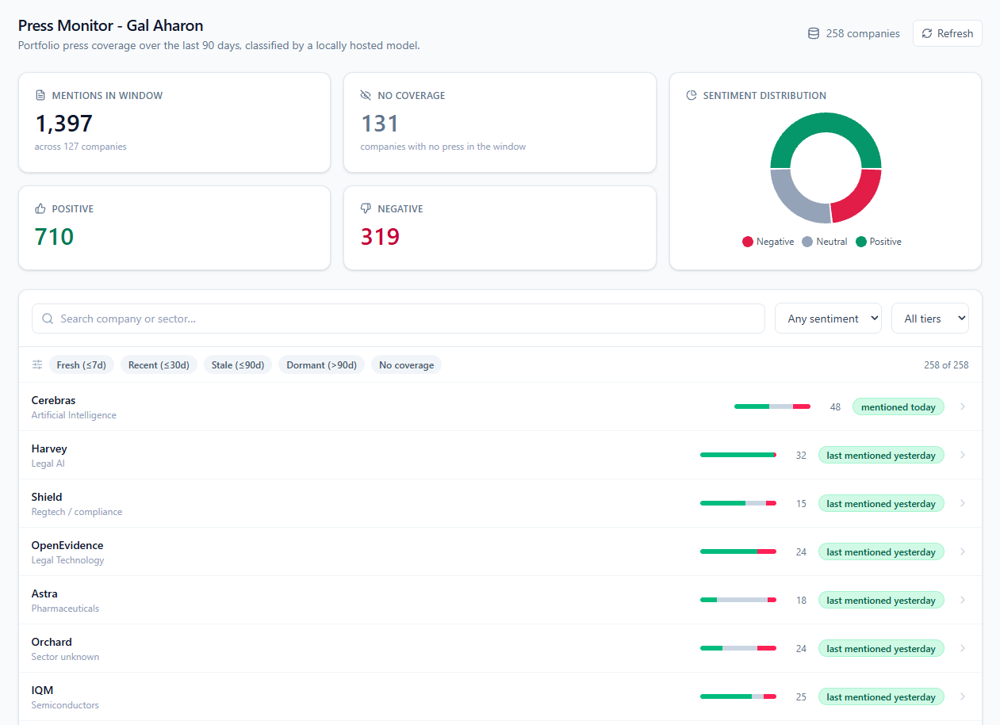
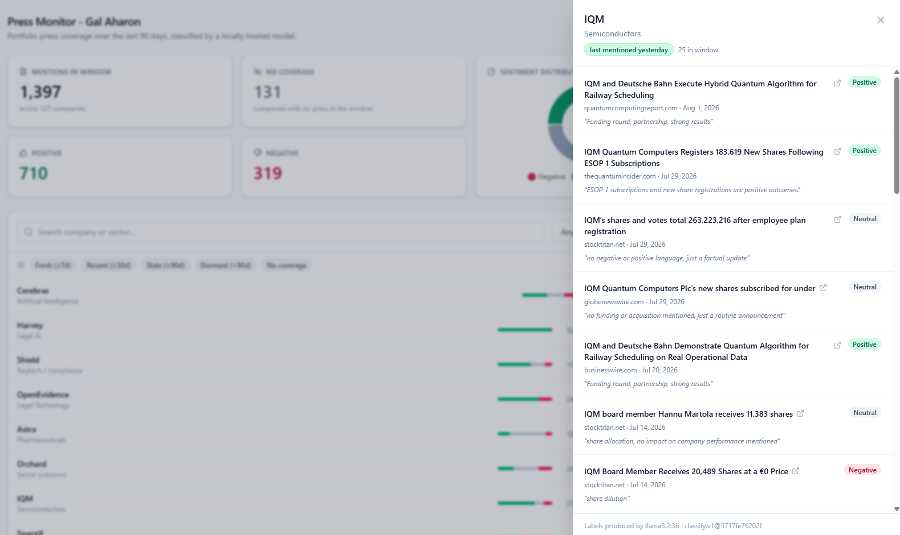
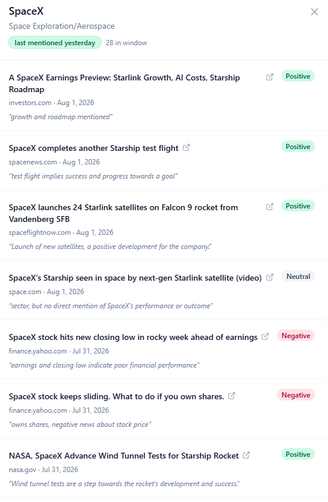

# OurCrowd Press Monitor

Monitors press coverage for 258 OurCrowd portfolio and fund companies, classifies each
mention's sentiment with a **locally hosted Ollama model**, and presents the results in a
dashboard with a daily new-coverage alert.

**No cloud LLM is used anywhere.** Every classification runs on `llama3.2:3b` through a local
Ollama daemon, and both news providers work without an API key — so this repository can be
cloned and run end to end without signing up for anything.

## What the numbers actually say

The measurements are the interesting part of this project, so they come first rather than
sitting under a feature list.

| Measurement | Result |
|---|---|
| Companies monitored | 258 |
| Production run | 123 min · 3,533 articles seen · **1,407 mentions published** |
| Companies with no coverage | **131 of 258** — an answer, not a gap |
| Deterministic pre-filter | removes **42%** of candidates for zero inference cost |
| Model selection | **0.52 combined macro-F1 — below the 0.80 bar this project set** |
| Relevance precision (production) | **83%** sampled · **~85%** weighted to the population |
| Sentiment accuracy | **75%**, with a systematic bias toward `positive` |

The model does not clear the accuracy bar. That is stated up front, measured three separate
ways, and explained below rather than left for a reader to find.

---

## Quickstart

```bash
# Prerequisites: Node.js >= 22.13 (24 recommended). Ollama only for steps that classify.
node --version
ollama --version

npm install          # no native compilation, no build tools
npm run verify       # lint + typecheck + 306 tests + docs consistency
```

Everything above needs nothing but the repository. So does this:

```bash
npm run collect -- --company Hailo --providers fixture   # the pipeline, fully offline
npm test                                                  # 306 tests, network disabled
```

To run it for real:

```bash
# 1. start the model
ollama serve                      # in another terminal
ollama pull llama3.2:3b

# 2. build the company registry (or use the committed data/companies.json)
npm run enrich                    # through the local model
npm run enrich -- --offline       # or from the human-approved query triage alone

# 3. collect, classify, export   (~2 hours for all 258 companies)
npm run backfill
npm run backfill -- --limit 10    # a short loop
npm run backfill -- --resume      # finish an interrupted run

# 4. look at it
npm run web:build && npm run serve      # http://localhost:3000

# 5. the daily check
npm run daily -- --dry-run        # report what would be alerted, send nothing
npm run daily                     # collect, classify, alert
```

---

## The dashboard



The grid ranks by **activity, not alphabetically** — a press monitor is opened to answer "what
happened lately", and A–Z ordering buries that. Companies with coverage come first, most
recently mentioned at the top, and the quiet ones settle at the bottom. `No coverage` is a
first-class filter and a distinct chip style, because for 131 of these companies it is the
correct answer rather than a gap.

The sentiment bar on each row is the positive/neutral/negative split at a glance; the count
beside it is mentions in the window.

> Screenshot taken mid-session, so its totals (1,397 mentions) sit between two exports. The
> committed `data/` files and the database now agree at 1,407.



Opening a company slides over its full quarter of coverage. Every headline links to its source,
and **every label carries the model's own one-line reason** — at 0.52 combined macro-F1 the
sentiment is not something a reader should take on trust, and the rationale is what lets them
disagree with it.

The drawer footer records provenance: `Labels produced by llama3.2:3b · classify.v1@5717fe76202f`.
That hash is the exact prompt file that produced those labels, stored on every row.



SpaceX is a good illustration of the sentiment axis being **investor-facing rather than
tonal**: Starlink launches and wind-tunnel progress read `positive`, while "stock hits new
closing low" and "stock keeps sliding" read `negative`, in the same week and for the same
company.

It also shows a documented weakness in plain sight. In the IQM drawer above, *"IQM Board Member
Receives 20,489 Shares at a €0 Price"* is labelled `negative` ("share dilution") while a nearly
identical share-registration headline two rows up is labelled `neutral`, and one rationale cites
a "funding round" that the headline never mentions. These are exactly the failure modes measured
in the spot-check, visible in the product rather than hidden behind an aggregate.

---

## Architecture

An npm-workspaces monorepo: a modular monolith with service-ready seams. Each package has one
job and depends only on the shared kernel, so any of them could become a service without being
untangled first.

```
packages/
  core/         Shared kernel. Config, logging, typed errors, deterministic ids,
                SQLite schema + repositories, status bucketing. Depends on nothing.
  collector/    Data collection. NewsProvider interface, GDELT + Google News + fixtures,
                query builder, normalisation and cross-provider dedupe, pre-filter,
                per-provider circuit breaker.
  classifier/   The LLM layer. Versioned prompt, zod schema with parse-and-repair,
                evaluation metrics, and the gold set.
  ollama/       Ollama client: structured output, deterministic options, jittered retry,
                content-hash cache, concurrency limiter.
  registry/     Seed-list parsing, enrichment schema, query construction.
  pipeline/     Orchestration: the backfill, the daily job, the data/ exporters.
  alerting/     Alerter interface with console and JSON-file sinks.
apps/
  api/          Read-only Express 5 API. Opens the database readonly.
  web/          React 18 + Vite + Tailwind + TanStack Query dashboard.
```

### The pipeline

```
companies.json → COLLECT → NORMALISE + DEDUPE → PRE-FILTER → PERSIST
                                                                 ↓
                              EXPORT ← PERSIST ← CLASSIFY (Ollama)
                                 ↓
                        API → dashboard        daily job → alerts
```

Two design points matter more than the diagram.

**Articles are persisted before classification.** A production pass takes two hours; a run that
only writes at the end loses everything to one interruption. Writing first means `--resume`
re-does only the inference that never finished.

**Everything is keyed on deterministic ids** — `sha256(canonical_url)` for articles,
`sha256(company_id:article_id)` for mentions — so re-running is an upsert, not a duplicate. That
is what makes the daily job safe to run twice, and it is asserted in the tests rather than
assumed.

---

## Data sources and their limitations

Two providers behind one `NewsProvider` interface, plus an offline fixture provider. Neither
live source needs an API key, which is deliberate: a reviewer can clone this repo and get real
data without signing up for anything.

| Provider | Role | Status |
|---|---|---|
| **Google News RSS** | Primary in practice | Verified live, end to end |
| **GDELT DOC 2.0** | Intended primary (honours exact-phrase boolean queries) | Code-complete, **rate-limited from this network since 2026-08-02** |
| **Fixture** | Offline corpus | `NEWS_PROVIDERS=fixture` runs the whole pipeline with no network |

Every limitation below was observed, not assumed.

- **Neither provider returns a snippet.** GDELT's `ArtList` has no such field, and Google News's
  `<description>` is an anchor tag plus a publisher name. **Classification runs on the headline
  alone — roughly ten words.** This is the single biggest constraint in the system and the root
  cause of most errors reported further down.
- **Google News does not honour boolean query syntax.** A live search for
  `"Peak" AND ("decision intelligence" OR "supply chain")` returned five articles, none about
  Peak. The pipeline re-applies its own query client-side, because that is the only place the
  semantics reliably hold.
- **Google News article links are unresolvable redirects.** The `guid` is an opaque token and
  following the link returns a JavaScript interstitial. The Google URL is stored — it does open
  the article — and the publisher domain is recorded separately so the same story from two
  providers still deduplicates on `(title, domain, date)`.
- **GDELT's rate limit is one request per 5 seconds**, stated nowhere except inside its own 429
  body. At 258 companies that is a floor of ~22 minutes per pass. A 429 is treated as an
  instruction rather than a flaky error: never retried, and it trips the circuit breaker
  immediately.
- **GDELT's `seendate` is when its crawler saw an article, not the publication date.**
  Cross-provider dedupe therefore compares dates within a 7-day tolerance rather than exactly.
- **Coverage skews to indexed online news.** Paywalled outlets are under-represented, results
  are relevance-ordered rather than chronological, and the feed caps at ~100 items.
- **Some companies genuinely have no recent press.** OncoHost returns zero articles in a 90-day
  window and its most recent coverage anywhere is four months old. `NO_COVERAGE` is a correct
  answer here, not a bug — see `data/coverage-baseline.json`.

---

## The local LLM

### Which model, and why

**`llama3.2:3b` with `prompts/classify.v1.md`.** Selected by measurement, not preference.

The task is 3-class sentiment plus a binary relevance judgement over a short headline — the
easiest class of LLM work — so model selection climbed a ladder from the smallest candidate
upward and stopped at the first rung good enough, rather than assuming bigger is better.

| Model | Relevance F1 | Sentiment F1 | Combined | JSON valid | p50 | 2,500 items |
|---|---|---|---|---|---|---|
| `qwen2.5:1.5b-instruct` | 0.650 | 0.345 | 0.498 | 95% | 9.9 s | 144 min |
| **`llama3.2:3b`** | 0.531 | 0.513 | **0.522** | 100% | 16.1 s | **233 min** |
| `qwen2.5:3b-instruct` | 0.650 | 0.343 | 0.497 | 100% | 16.5 s | 246 min |

A second prompt (`prompts/classify.v2.md`) was written to attack the specific failures above and
evaluated against the same gold set:

| Model | v1 combined | v2 combined | Δ |
|---|---|---|---|
| `qwen2.5:1.5b-instruct` | 0.498 | 0.450 | −0.048 |
| `llama3.2:3b` | 0.522 | 0.434 | −0.088 |
| `qwen2.5:3b-instruct` | 0.497 | **0.577** | **+0.081** |

`qwen2.5:3b` + v2 scores highest at **0.577**, and it was not shipped. Two reasons, both
measured:

1. **It projects to ~7 hours for a production run**, against 233 minutes for the shipped
   configuration — v2's longer prompt roughly halves throughput.
2. **The gain is a threshold slide, not better discrimination.** Per item, v2 fixed 13 and broke
   11, and the split was perfectly clean: *every* fix was genuine coverage it had been
   rejecting, *every* break was a decoy it now accepted. The model traded decoy rejection for
   coverage recall one for one. A third prompt would re-tune the same knob.

**The 0.80 macro-F1 bar this project set was not met.** The best measured configuration is
0.522. The ship rule — smallest model within 2 points of the best — selects *among models that
clear the bar*, so it was not applied mechanically to dress up a failure.

### How the model is invoked

One call per article returning relevance and sentiment together, which halves inference cost
versus two passes.

- **Prompt:** `prompts/classify.v1.md` — a file rather than a string literal, because its hash is
  stored on every classification row. A label is only auditable if you can prove which
  instructions produced it.
- **Input:** company name, sector, aliases and up to three negative keywords, then the headline.
  This is where the registry enrichment earns its keep: *"Shield AI: $1.5B Series G"* is
  unanswerable from a headline until the model knows our Shield does communications compliance.
- **Output:** JSON constrained by Ollama's `format` parameter —
  `{ relevant, sentiment, confidence, rationale, evidence }`. `sentiment` is a four-value string
  including `not_applicable` rather than a nullable enum, because union types in `format` are
  inconsistent across models, and a model that cannot emit `null` emits something else.
- **Determinism:** `temperature: 0`, fixed seed, `num_ctx: 1024`, `num_predict: 96`.
- **Repair:** casing, synonyms and 0–100 confidence scales are normalised deterministically. Two
  things are refused rather than repaired: an unrecognised sentiment, and a relevant item with
  no sentiment. `relevant: false` forces `sentiment: null` — a model saying "not about this
  company, sentiment positive" is contradicting itself.
- **Cache:** content-hash keyed on model + prompt version + text, so re-runs are near-free and an
  A/B between prompts cannot be served the other prompt's answers.

---

## How classification quality was validated

Three independent measurements, each with its limits stated.

### 1. The gold set — `packages/classifier/eval/gold-set.json`

60 items sampled from **live Google News results**, so the evaluation measures the input the
system actually receives. Stratified by *observable* features only — ambiguity tier, pre-filter
verdict, loss-language in the headline — never by the answer, because sampling "twelve
negatives" would require first deciding what is negative, and that circularity is what makes an
evaluation worthless.

Labels: **39 relevant / 21 decoys**; among the relevant, **20 positive, 7 negative, 12 neutral**.

**Disclosure.** Labels were **drafted by an AI assistant (Claude) and reviewed, corrected and
approved by the project owner.** That is weaker than a set hand-labelled from scratch, and it is
stated rather than glossed over. Two things keep it honest: the drafting assistant is *not* a
bake-off candidate, so the evaluation is not self-referential; and labelling was completed
**before any candidate model saw the data**.

**Known limits.** The negative class has only **7 items** — negative press is genuinely rare in a
90-day window, and stratifying on observable features cannot manufacture it. A single
misclassification moves that class by ~14 points, so negative figures are always reported with
their support count, and macro-F1 inherits the same instability. Sixty items is enough to
separate a model that works from one that does not; it is not enough to rank two close models
confidently.

### 2. The production spot-check — `data/spot-check.json`

24 mentions drawn deterministically from the published set, stratified to over-weight the
critical/high ambiguity tier where errors concentrate. A uniform sample would be dominated by
distinctive names like ZutaCore and would report a flattering number that said nothing about
Shield or Astra.

| | |
|---|---|
| Relevance precision | **20/24 (83%)** |
| — critical/high tier | **10/14 (71%)** |
| — medium/low tier | **10/10 (100%)** |
| Sentiment accuracy | **15/20 (75%)** of correctly-identified mentions |
| Weighted to the population (51% ambiguous-tier) | **~85% precision · ≈211 false positives of 1,407** |

This measures **precision only**. Articles the pipeline never found are invisible here;
`data/coverage-baseline.json` is the closest thing to the other half.

### 3. The coverage baseline — `data/coverage-baseline.json`

Across the 57 human-approved companies: 1,038 candidates fetched, with rejections broken down as
435 `no-name-match`, 28 `negative-keyword`, 293 `missing-qualifier`. Every rejection is persisted
with its reason, so precision can be measured rather than asserted.

---

## What goes wrong, and why

### Homonyms are the dominant failure mode

The seed list contains many ordinary words: Peak, Shield, Island, Ro, Astra, Near, Launchpad,
Kini, Wave, Orchard, Silo, Guild. Across the production run this is where essentially all the
error lives.

Reviewing every published mention for the two worst names by hand:

| Company | Published | Actually about the company |
|---|---|---|
| **Peak** | 13 | **0** |
| **Shield** | 15 | **2** |

Real rows from `data/mentions.json`:

```
Peak    "SpaceX Stock Slides 51% From Peak; AI Division Valuation Tested"
Peak    "We are not at the peak of the AI cycle: Eastspring"
Peak    "Japan's Nikkei scales record peak as AI shares track US chip rally"
Shield  "Paystack Unveils Massive 'Small Business Bundle' To Shield Nigerian SMBs"
Shield  "Coronation Insurance, MTN MoMo launch 'Smart SME Plan' to shield traders"
Shield  "RBI Moves to Shield Banks From Emerging AI Threats"
Astra   "Ad ASTRA Community Workshop: Detailed Schedule Available"    (science.nasa.gov)
Arrow   "CPPIB exits loan portfolio to Arrow Global, Fortress"        (UK credit manager)
```

**`Shield AI: $1.5 Billion Series G` was classified as relevant while the prompt held both the
company's sector and the negative keyword `Shield AI`.** The instruction was present and ignored.

The aggregate 85% precision therefore hides a much worse per-company picture: most companies are
near-perfect, and a handful of dictionary-word names are almost entirely noise. Both numbers are
true; the second is the one that matters for a product.

### Sentiment has a systematic optimism bias

In the spot-check, **every sentiment error ran the same direction: `positive` where `neutral` was
correct.** Five for five.

```
"Harvey and Legora ramp up battle for legal AI dominance"        → two-sided competitive story
"28. Island"                                                     → a bare list entry
"Stellar Cyber and M-Theory to Demo ... at Black Hat USA 2026"   → conference PR, no result
"Stoke Space's Nova rocket prepares for flight"                  → pre-launch status
"Klook India launches campaign with Farah Khan"                  → marketing activity
```

This is consistent with the bake-off, where the shipped model's neutral recall was 0.50 against
positive recall of 0.70. **The published split of 716 positive / 369 neutral / 322 negative
overstates positive coverage**, and the dashboard should be read with that in mind.

One rationale is worth quoting, because it shows what a 3B model does when a headline gives it
nothing to work with. For `28. Island` it answered: *"Number '28' implies a specific, positive
outcome."*

### A gap in our own rubric

*"Elon Musk's xAI sues to stop Minnesota nudification law"* was labelled `negative`. xAI is the
**plaintiff**, not the defendant. The sentiment rubric lists "lawsuit/investigation" as negative
without distinguishing the two, so this is a specification gap rather than a model error. A v2
rubric should separate "sued" from "suing".

---

## Production V2 roadmap

These failures are not equally hard to fix. In rough order of value per hour:

### 1. Named-entity recognition before the LLM

**The obvious fix does not work.** Case-sensitive matching — accept `Shield` only when
capitalised — fails because news headlines are Title-Cased:

```
"...Small Business Bundle To Shield Nigerian SMBs"      ← capital S, common verb
"SpaceX Stock Slides 51% From Peak"                     ← capital P, common noun
"Oklo Stock Has Fallen 70% From Its Peak."              ← capital P, common noun
```

Capitalisation carries no signal in this corpus. Part-of-speech or NER does: a spaCy or
DistilBERT NER pass can tell an `ORG` entity from a verb or common noun, runs in milliseconds on
CPU, and would reject *"To Shield Nigerian SMBs"* on grammar alone without an LLM call. This is
the highest-value change available and it is cheap.

### 2. Sector-conditioned matching for dictionary-word names

For the ~25 CRITICAL-tier names, require corroborating sector evidence rather than treating the
name as sufficient. The mechanism already exists as the qualifier groups in the query builder;
the current soft-pass rule sends unmatched items to the LLM instead of rejecting them. With NER
in place, that trade could be reversed for this tier specifically.

### 3. Fetch the article body

Everything above is downstream of one constraint: **ten words is not enough text.** A readability
pass over the article URL would give the classifier 200–500 words instead of 10, and most of the
errors documented here — the bare list entry, the ambiguous "28. Island", the
plaintiff/defendant distinction — dissolve with context. The cost is latency, paywalls and
robots.txt, which is why it was deferred.

### 4. A separate relevance model

Relevance is binary classification of short text, which a fine-tuned ~110M-parameter encoder does
better and roughly 30× faster than a 3B generative model. This was considered and rejected here
because the task mandates Ollama; for a production V2 it is the correct tool.

### 5. Reduce the zero-coverage baseline

**50.8% of the portfolio (131 of 258 companies) has no coverage in the window.** Some of that is
genuine — OncoHost's most recent press anywhere is four months old, and no amount of ingestion
recovers an article that does not exist. But some of it is reach, and three additions would
separate the two:

1. **Full-text article-body search** via a paid news API (NewsAPI, Event Registry). Both current
   providers match on headline metadata only, so a company mentioned in the third paragraph of a
   funding round-up is invisible to us.
2. **Brand alias and subsidiary mapping** in `companies.json`. Coverage frequently names a
   product, a regional entity or a former name rather than the registered company — the registry
   already has an `aliases` field, and it is currently thin because the enrichment model
   populated it conservatively.
3. **PR distribution feeds** — PR Newswire, GlobeNewswire, Business Wire. For B2B portfolio
   companies the press release *is* the primary source, and it is published on a predictable
   feed rather than having to be discovered.

The honest caveat: a paid API breaks the zero-key property this project deliberately holds, so it
belongs behind the existing `NewsProvider` seam as an opt-in provider rather than as a default.

### 6. Calibrate sentiment against the observed bias

The optimism bias is systematic and therefore correctable — by prompting explicitly against it,
by routing low-confidence `positive` predictions to `neutral`, or by a few-shot set weighted
toward neutral examples.

---

## Setup and configuration

### Requirements

- **Node.js ≥ 22.13** (24 recommended). Storage uses `node:sqlite`, built into Node — no native
  compilation, no Visual Studio Build Tools, nothing that can fail during `npm install`.
- **Ollama** for anything that classifies. Not needed for the tests or the offline pipeline.

```bash
ollama serve
ollama pull llama3.2:3b
```

### Environment

Every variable has a working default; `.env` is optional. See `.env.example`.

| Variable | Default | Purpose |
|---|---|---|
| `OLLAMA_HOST` | `http://127.0.0.1:11434` | Local Ollama endpoint |
| `OLLAMA_MODEL` | `llama3.2:3b` | The model the bake-off selected |
| `OLLAMA_CONCURRENCY` | `3` | Measured optimum — 6 is *slower* than 3 on this hardware |
| `OLLAMA_NUM_CTX` | `1024` | Right-sized to the real input (777 tokens, measured) |
| `OLLAMA_NUM_PREDICT` | `96` | Output cap; output tokens dominate latency |
| `QUARTER_WINDOW_DAYS` | `90` | Definition of "last quarter" (rolling) |
| `MAX_ITEMS_PER_COMPANY` | `25` | Budget cap, so a loud company cannot consume the run |
| `NEWS_PROVIDERS` | `gdelt,googlenews` | Ordered list; `fixture` for offline |
| `ALERT_CHANNELS` | `console,file` | Comma-separated sinks |
| `ALERT_LOOKBACK_HOURS` | `48` | An article older than this is stored but not alerted |
| `DB_PATH` | `./data/press.sqlite` | SQLite file |

### Commands

```bash
npm run verify                # lint + typecheck + 306 tests + docs consistency
npm test                      # tests only; the suite never touches the network

npm run enrich                # build data/companies.json through the local model
npm run backfill              # full run: collect, classify, export
npm run backfill -- --resume  # finish an interrupted run
npm run daily                 # the daily check and alert
npm run serve                 # API + built dashboard on :3000
npm run scheduler             # long-running node-cron process (CRON_SCHEDULE/CRON_TIMEZONE)
npm run web:dev               # dashboard with hot reload (proxies to :3000)

npm run bench                 # Ollama throughput, measured rather than guessed
npm run eval                  # the gold-set bake-off across the model ladder
npm run spot-check            # sample production output for manual review
npm run audit:coverage        # zero-coverage baseline across the approved companies
npm run measure:prefilter     # live pre-filter precision probe
```

---

## Scheduling

The daily check is an **idempotent CLI**, and scheduling is a separate decision from what runs.
Four paths, all calling the same command:

| Path | Command | Notes |
|---|---|---|
| **OS cron / systemd timer** | `npm run daily` | Simplest for a machine that already runs Ollama |
| **node-cron process** | `npm run scheduler` | Explicit IANA timezone, boot catch-up, keeps running after a failed run |
| **GitHub Actions** | `.github/workflows/daily.yml` | Committed and documented — see the caveat below |
| **n8n / Make** | HTTP or shell node calling the CLI | Not built; the CLI is the integration point |

The GitHub Actions workflow carries an honest caveat, stated in the file itself: hosted runners
have no Ollama, so classification cannot run there as written. It executes against the fixture
provider, which genuinely exercises the schedule, the overlap lock, the watermark and the alert
sinks — but it is not pretending to classify. Making it real means either a self-hosted runner
with Ollama, or splitting collection from classification, which the pipeline already supports
because articles are persisted before inference.

`npm run scheduler` adds three things over a bare cron entry: an **explicit timezone** (`0 8 * * *`
means nothing without one, and GitHub's cron is UTC-only so it drifts across DST), **boot
catch-up** so a missed schedule runs at start rather than waiting a day, and a guarantee that a
failed run **does not kill the scheduler** — tomorrow's check is worth more than today's stack
trace.

---

## The `data/` folder

Committed output of the production backfill (2026-08-02 · 258 companies · 123 minutes) plus the
daily runs that followed. Every file is exported from the same database, so `npm run serve` and
these files always agree — a fresh-clone rehearsal caught them drifting apart once, when the
JSON was written at the end of the backfill and the database kept accumulating.

| File | Contents |
|---|---|
| `companies.json` | The enriched registry — 258 records, 57 human-approved queries |
| `mentions.json` | 1,407 published mentions with sentiment, rationale and source URL |
| `company_status.json` | **All 258 companies**, including the 131 with no coverage |
| `quarterly_summary.json` | Aggregates powering the dashboard |
| `alerts.log.json` | Real alerts from the daily job |
| `press.sqlite` | The database itself |
| `bakeoff.v1.json` · `bakeoff.v2.json` | Full per-item model evaluation results |
| `spot-check.json` | The 24 hand-reviewed production mentions |
| `coverage-baseline.json` | Per-company candidate and rejection counts |
| `benchmark.json` | Throughput measurements |

### Company registry provenance

Every row in `data/companies.json` records **where its search query came from**:

| `querySource` | Count | Meaning |
|---|---|---|
| `human-approved` | 57 | A person reviewed and signed off this query (the CRITICAL/HIGH names) |
| `llm-enriched` | 130 | Built from local-Ollama enrichment output |
| `triage-default` | 71 | Generated query for an unreviewed MEDIUM/LOW name |
| `fallback` | 0 | Bare exact phrase; nothing else was available |

A row is not marked `human-approved` merely because it shares a file with rows that were.
`scripts/enrich-companies.ts` works on any seed list (`--seed <path>`), so the pipeline is not
tied to the 258 companies supplied with this task.

---

## Testing

**306 tests**, and the whole suite runs with **no network access**. Two integration tests replace
`globalThis.fetch` with a rejecting stub, so a regression that reintroduces a live call fails the
build rather than quietly making CI depend on GDELT being up.

```bash
npm test
npm run verify        # adds lint, typecheck and a documentation-consistency gate
```

The tests worth knowing about:

- **Idempotency** — the daily job runs twice, the second run delivers zero alerts, and the
  database is unchanged. Idempotency bugs are silent, so this is asserted rather than trusted.
- **Whole-word matching** — `Peak` must not match `Peakhurst`, and the human-approved negative
  keyword `launch pad` must not match `Launchpad`. Several approved negatives discriminate
  purely by spacing.
- **Boolean query parsing** — including the 16 registry queries that an earlier regex-based
  reader silently misparsed.
- **No-coverage handling** — a company with no press appears in every export and in the UI.

---

## Assumptions and trade-offs

| # | Ambiguity in the brief | Decision |
|---|---|---|
| A1 | "Last quarter" — calendar or rolling? | **Trailing 90 days**, rolling, configurable |
| A2 | The company list has names only, no domains or sectors | Enriched through the local model into a committed, human-reviewed registry |
| A3 | Ambiguous company names | Five-layer defence: registry enrichment, query construction, deterministic pre-filter, LLM relevance gate, persisted rejection reasons |
| A4 | Very-high-volume names (SpaceX, Stripe) | `MAX_ITEMS_PER_COMPANY` cap, so a loud company cannot consume the run |
| A5 | What counts as a "new mention" for the alert | A `(company, article)` pair never persisted **and** published within `ALERT_LOOKBACK_HOURS` |
| A6 | Full text, or headline + snippet? | Headline only — neither provider returns a snippet. The dominant constraint on accuracy |
| A7 | Sentiment of what, exactly? | Toward the company, from an **investor's** perspective — not the article's general tone |

Trade-offs taken knowingly:

- **TypeScript, not plain JavaScript.** The brief says "JavaScript (Node.js)"; TypeScript
  compiles to it, and the type checking caught real defects — including a browser bundle
  accidentally importing the SQLite kernel.
- **SQLite over a hosted database.** Unique constraints and indexed date-range queries matter
  here; a network dependency does not.
- **Slack alerting cut.** The `Alerter` interface ships, and console + file work with zero
  configuration, so adding a webhook is a small addition rather than a rewrite.
- **The 90-day trend chart cut** in favour of finishing the evaluation harness. Given fixed
  hours, evidence that the classifier works is worth more than a second chart.

## Known gaps

Stated plainly, because a partially complete solution with clear notes is more useful than an
undocumented "complete" one.

- **The model misses the accuracy bar** this project set for itself (0.52 vs 0.80 combined
  macro-F1).
- **Dictionary-word company names are largely noise** — Peak published 13 mentions and none of
  them are the company.
- **Sentiment skews positive**, systematically and measurably.
- **GDELT is unverified against live traffic** from this network. The provider is code-complete
  with 25 offline tests; it has returned HTTP 429 since 2026-08-02.
- **11 mentions remain unclassified** from the production run — `npm run backfill -- --resume`.
- **Gold-set and spot-check labels are AI-drafted and human-reviewed**, not hand-labelled from
  scratch.

## Licence

MIT — see `LICENSE`.
